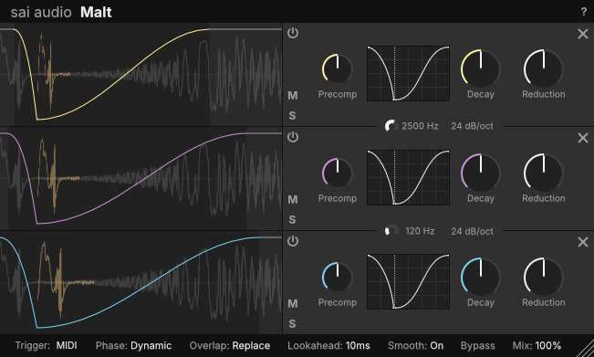
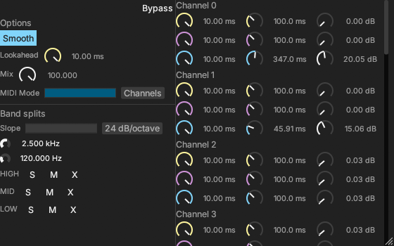

# Malt - Multiband Sidechain Plugin (WIP)

_(^ Mockup design, not actual product)_

This was intended to be a MIDI-triggered multiband-sidechain plugin, where each band can have a different curve, attack/release times.

However, the `nih-plug` framework is not mature enough and I've run into a lot of issues:

- Text input does not work on Windows (https://github.com/robbert-vdh/nih-plug/issues/154, https://github.com/RustAudio/baseview/issues/192)
    - the `"windows_keyboard_workaround"` workaround in `nih_plug_egui` doesn't fix the issue
- Unable to hide/lock mouse cursor when dragging a knob (https://github.com/robbert-vdh/nih-plug/issues/179)
- CLAP plugin randomly crashes when changing latency (https://github.com/robbert-vdh/nih-plug/issues/177)
- Opening/Closing GUI causes a memory leak and eventually causes out-of-memory (https://github.com/robbert-vdh/nih-plug/issues/173)

## Actual progress

_(^ Very quick-and-dirty UI for development)_

The logic and features are all done, all that's left is the UI.

Recreating the mockup UI is practically impossible in egui, unless I decide to hard-code the locations of each element (But since I'm using a resizable window, hard-coding isn't feasible). The layout system is too inflexible and limited for dynamic layouts like in the mockup.

I could use [egui_flex](https://crates.io/crates/egui_flex), but it causes a weird flashing effect when resizing the window so I'm still undecided on this.

In the future I might decide to rewrite the entire GUI using Iced instead. TBC.
